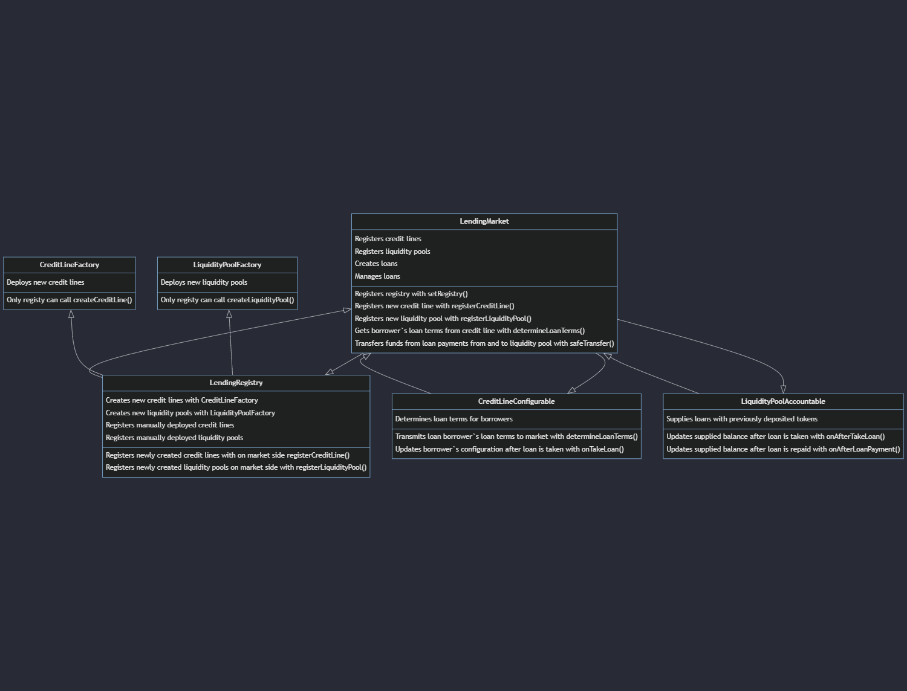
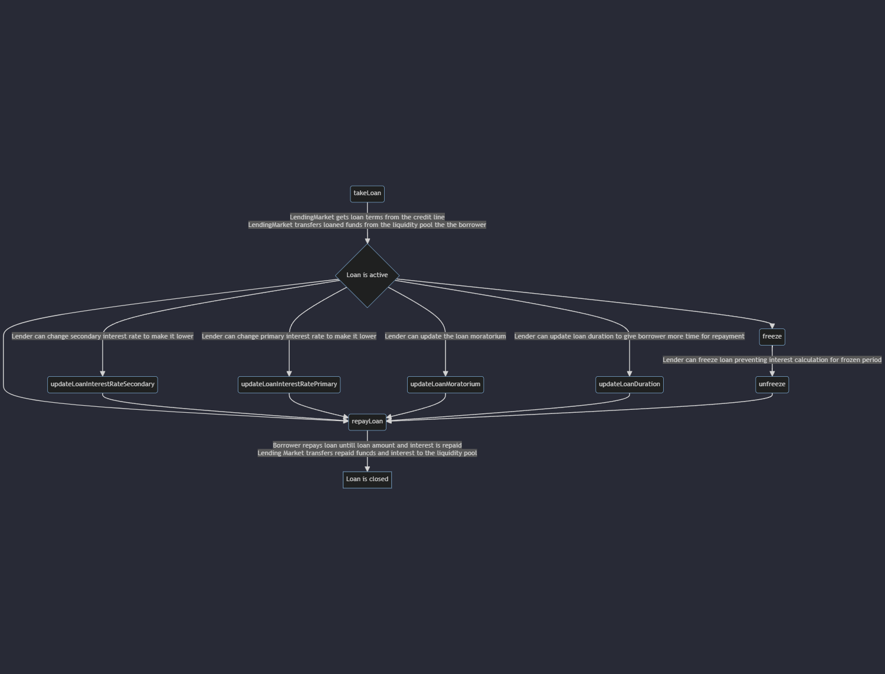
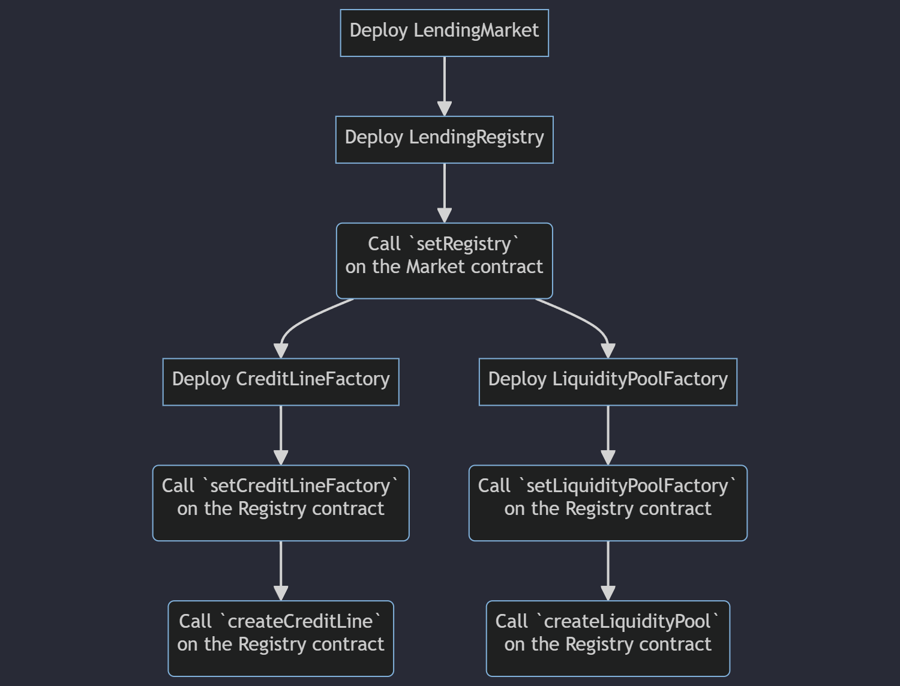

# CapybaraFinance Docs

## Table of Contents
- [Introduction](#introduction)
- [Lending Market](#lending-market)
- [Credit Lines](#credit-lines)
- [Liquidity Pools](#liquidity-pools)
- [Lending Registry](#lending-registry)
- [Credit Line Factory](#credit-line-factory)
- [Liquidity Pool Factory](#liquidity-pool-factory)
- [Deployment instruction](#system-deployment)

---
## Code usage description

**[Detailed documentation about contracts implementation and functionality](./documentation/contracts)**
 

**[List of protocol`s custom errors](./documentation/general/Errors.md)**
 

**[List of protocol`s events](./documentation/general/Events.md)**
 

**[List of protocol`s types](./documentation/general/Types.md)**

## Introduction
CapybaraFinance protocol establishes a framework for users to lend or borrow funds within a decentralized and transparent system.
The protocol is composed primarily of several interlinking smart contracts – addressing components such as loans, credit lines, liquidity pools, registry and the lending market. These individual components work hand in hand to create a robust lending process, starting from creating a credit line, to borrowing, and finally, repayments and management of loans.

## System overview:
1. **LendingMarket** The main contract of the system responsible for loan creation, management and repayments. Registers new liquidity pools and credit lines to connect them to the system. It is also responsible for tracking and enforcing the states and statuses of all loans and minting and managing nft.
2. **LendingRegistry** The contract responsible for creating and registering new credit lines and liquidity pools.
3. **CreditLineFactory** A smart contract to create and manage different kinds of credit lines within the protocol. Currently, it supports creating only a specific kind of configurable credit line but is designed to potentially support more kinds in the future.
4. **LiquidityPoolFactory** A smart contract to create and manage different kinds of liquidity pools within the protocol. Currently, it supports creating only a specific kind of accountable liquidity pool but is designed to potentially support more kinds in the future.
5. **CreditLine** The lender is using credit lines to determine loan terms for each borrower. While borrower is taking loan, they can choose which credit line would be used to determine loan terms.
6. **LiquidityPool** The lender is using liquidity pool to supply loans. Loaned funds are transferred from the pool to the borrower, and, after the repayment and collecting interest, from the borrower to the pool.

## Loan lifecycle:
A loan is defined with all its associated elements like status, token address, duration, interest rates, among other details. This struct encapsulates all the data and operations around a single loan in the system.
Loan can be managed and changed by the lender <i>only</i> to improve loan conditions for the borrower.

## Problem It Solves:
This protocol provides a robust infrastructure that solves several pain points associated with traditional lending:

1. It introduces transparency and trustlessness into the lending process as all loan terms and transactions are recorded on the blockchain.
2. It enables peer-to-peer lending and faster loan processing by eliminating the need for manual approval processes typically associated with traditional financial institutions.
3. It democratizes access to credit by allowing anyone, regardless of their geographical location, to lend or borrow on the platform – provided they meet the necessary conditions defined within the protocol.

Please read through the subsequent sections for more specific details on each component of the protocol.

---

## [Lending Market](documentation/contracts/LendingMarket.md)

The Lending Market contract is the centerpiece of the protocol that facilitates the transfer of funds between borrowers and lenders, utilizing the mechanisms of Credit Lines and Liquidity Pools. It manages loans by creating and tracking a unique identifier `loanId` for each loan. It also handles updates to the loan status and other loan properties such as duration, moratorium, primary and secondary interest rate.

### Borrowing

The borrowing process begins when a borrower initiates the `borrow` function, indicating a desired credit line and loan amount. The credit line determines the loan terms based on the borrower's profile. The loan amount is transferred from the lender's liquidity pool to the borrower. The contract assigns a unique 'loanId' to this loan, changes its status to 'Active'.

### Repaying

To repay the loan, the borrower initiates the `repay` function, indicating the `loanId` and repayment amount. The repayment amount is transferred from the borrower to the lender's liquidity pool. The loan's status may change to 'Repaid' if the loan is fully repaid. The repayment date, repayed amount, remaining balance and any status changes are logged in an event.

### Interest Updates & Other Loan Management

The contract allows for updates to the loan terms during its lifecycle through `updateLoanDuration`, `updateLoanMoratorium`, `updateLoanInterestRatePrimary`, and `updateLoanInterestRateSecondary`. Each change triggers an event that logs the 'loanId', the old and new value.

---

## Credit Lines

A credit line, in our protocol, is a smart contract that regulates the borrowing process between two parties.

The borrower interacts with the credit line contract to initiate the borrowing process by providing certain details and requesting a certain amount to borrow. The contract, depending on the borrower's history and the requested amount, determines the terms of the loan such as the interest rate and duration. This process operates without any intermediaries making it efficient and straightforward. The borrower can track their loan status and repayments, which makes the process very transparent and easy to manage.

A lender provides liquidity to the pool, which can then be used for loans. The lending process is governed by the credit line contract, which matches borrowers and lenders automatically. The contract ensures that the terms of the loan are complied with and that the lender receives the repayments along with the agreed-upon interest. This process facilitates lending as it eliminates the need for manual management and verification.

---

## [Configurable Credit Line](documentation/contracts/lines/CreditLineConfigurable.md)

The `CreditLineConfigurable` contract serves as the hub for managing the configuration of a credit line within the decentralized lending protocol. It determines various settings and parameters for the credit line, handles the interaction between borrowers and the credit line, and manages administrative roles and privileges.

The contract allows for configuration of administrators with the use of the `configureAdmin` function. These admins have privileges to update borrower configurations.

#### Token Configuration

The `configureToken` function is used to bind a token with a credit line. This function can only be called by the contract owner and only once to avoid changes in the middle of an operation.

#### Borrower Configuration

Borrower configuration is achieved with the `configureBorrower` function that sets the borrowing parameters for an individual borrower. This includes the minimum and maximum amount they can borrow, and their specific borrowing policy.

#### Credit Line Configuration

The `configureCreditLine` function allows the definition of the overall credit line terms such as min and max borrow amount, the loan duration, and interest rates.

#### Loan Terms Determination

Upon loan initiation by a borrower, the `determineLoanTerms` function is called to finalize the terms of the loan based on the borrower's configuration and the overall credit line configuration.

### Detailed Implementation

#### Admin Configuration

The `configureAdmin` function is used to set and revoke administrative roles. This can only be executed by the contract owner.

#### Token Configuration

The `configureToken` function is used to associate a specific token with the credit line. This function can only be executed by the account that owns the contract.

#### Borrower Configuration

The `configureBorrower` function is used to set borrowing conditions for individual borrowers. This includes the minimum and maximum amounts a borrower can take out as a loan, and the expiration date of the borrower's configuration. This function is accessible by administrators and has a `pause` function to prevent changes.

#### Credit Line Configuration

The `configureCreditLine` function is used to set the terms of the overall credit line. This includes the minimum and maximum amount that can be borrowed, loan duration, and interest rates. The ability to execute this function is restricted to the owner of the contract.

#### Loan Terms Determination

When a loan is taken out, the `onLoanTaken` function gets triggered, calling `determineLoanTerms` to finalize the terms of the loan that are grounded on the credit line's and borrower's configurations.

#### Addon Payment Calculation

The `calculateAddonAmount` function is used to calculate the additional payment amount for a loan based on a fixed cost rate and a period cost rate.

#### Pause and Unpause

The contract can be paused and unpaused by the owner of the contract with the `pause` and `unpause` functions respectively.

### Security Measures

The contract includes several security measures, such as the Ownable and Pausable modules, from the OpenZeppelin library.

### Interactions with Other Components

The `CreditLineConfigurable` interacts with the lending market contract, receiving triggers from the lending market contract when a loan is taken out and responds by determining the loan terms based on the credit line's and borrower's configuration.

---

## Liquidity Pools

A liquidity pool, in the context of our lending protocol, is a pool of funds that lenders contribute to and borrowers can take loans from.

For a lender, a liquidity pool serves as a platform where they can deposit their funds to earn interest. The funds they deposit are not tied to a specific loan or borrower but are utilized as the overall funds available to all borrowers in the system.

Borrowers interact with the liquidity pool via a credit line, which defines their loan terms. Once the loan is initiated, funds from the liquidity pool are transferred to the borrower's account.

---

## [Accountable Liquidity Pool](documentation/contracts/pools/LiquidityPoolAccountable.md)

The `LiquidityPoolAccountable` contract is a concrete implementation of the `ILiquidityPoolAccountable` and `ILiquidityPool` interfaces. It is designed to manage financial interactions between the liquidity pool and its associated credit lines and loans.

### Key Features

#### Deposit & Withdraw

This contract enables tokens to be deposited into and withdrawn from the liquidity pool. It is essential to note that both of these operations can only be performed by the contract owner.

#### Credit Line Management

Keeps a record of the balance of each credit line, allowing for funds to be allocated and reclaimed as loans are availed and repaid.

#### Loan Interaction Hooks

Provides hooks to act on events such as 'before and after loan taken' or 'loan being repaid'. These hooks assist in updating the balances of the relevant credit lines and the liquidity pool.

#### Rescue Feature

Provides a utility function to rescue tokens accidentally sent to the contract.

### Detailed Implementation

#### Deposit & Withdraw

The `deposit` function deposits tokens into the liquidity pool, updates the balance of the given credit line and transfers the tokens from the sender to the contract.

The `withdraw` function withdraws tokens from the liquidity pool, updates the balance of the given token source and transfers the tokens from the contract to the sender.

#### Credit Line Management

The `getTokenBalance` function returns the balance of the given token source, whether it's a credit line or a native token.

The `getCreditLine` function returns the credit line associated with the given loan id.

#### Loan Interaction Hooks

- The `onBeforeLoanTaken` and `onAfterLoanTaken` hooks are called before and after a loan is taken. They don't take any action by default, but can be overridden to provide additional functionality.

- The `onBeforeLoanPayment` and `onAfterLoanPayment` hooks are called before and after a loan repayment. They update the balances of the credit line and the liquidity pool.

#### Pause and Unpause

The contract can be paused and unpaused by the contract owner using the `pause` and `unpause` functions respectively.

### Security Measures

Includes robust security features to ensure the safety of funds and operations within the protocol. Safety measures include, but are not limited to, access controls and emergency stop mechanisms provided by the OpenZeppelin library's Ownable and Pausable contracts.

### Interactions with Other Contracts

`LiquidityPoolAccountable` interacts with the lending market contract. It receives triggers from the lending market contract when a loan is taken or repaid and responds by updating relative balances.

## [Lending Registry](documentation/contracts/LendingRegistry.md)

The `LendingRegistry` is a crucial part of the CapybaraFinance ecosystem. It serves as a centralized directory that is used for the creation of new credit lines and liquidity pools and where the details of credit lines and liquidity pools creations are recorded and managed.

### Key Features of the Lending Registry:

- Registry of Credit Lines and Liquidity Pools: The `LendingRegistry` maintains a list of active credit lines and liquidity pools, along with their configurations and associated parameters.
- Integration with `LendingMarket`: The registry is tightly integrated with the Lending Market, facilitating the efficient operation of credit lines and/or liquidity pools creation and management processes.
- Access Control: It manages access rights, allowing only authorized parties to configure factory contracts, but any user to deploy their own credit line and liquidity pool.

## [Credit Line Factory](documentation/contracts/lines/CreditLineFactory.md)

The `CreditLineFactory` contract is responsible for the creation of new credit lines within the CapybaraFinance protocol. It is an expandable component that ensures contracts are created with consistent standards and security measures in place.

### Creation of Credit Lines
`CreditLineFactory` utilizes a factory pattern to standardize the creation of credit lines. It allows for only a specific kind of credit line at present but includes an error handling mechanism for unsupported pool types to ensure future extensibility.

### Supported Credit Line Types
Currently, supports the creation of a single kind of configurable credit line, designed to define loan creation terms and configurations.

### Ownership and Access Control
The factory contract inherits from the `Ownable` contract, ensuring that only the owner has the authority to create new credit lines.

### Events
Emits an event upon the successful creation of a new credit line, which includes details such as the kind of credit line created and its associated address.

### Error Handling
Incorporates a custom error `UnsupportedKind` to handle attempts at creating unsupported types of credit lines, ensuring transparent and clear communication of operational boundaries.
documentation/contract
For a comprehensive explanation of how the `CreditLineFactory` operates and integrates with the other components of the CapybaraFinance protocol, please see the [Credit Line Factory documentation](documentation/contracts/lines/CreditLineFactory.md).

## [Liquidity Pool Factory](documentation/contracts/pools/LiquidityPoolFactory.md)

The `LiquidityPoolFactory` contract is responsible for the creation of new liquidity pools within the CapybaraFinance protocol. It is an expandable component that ensures pools are created with consistent standards and security measures in place.

### Creation of Liquidity Pools
`LiquidityPoolFactory` Utilizes a factory pattern to standardize the creation of liquidity pools. It allows for only a specific kind of liquidity pool at present but includes an error handling mechanism for unsupported pool types to ensure future extensibility.

### Supported Pool Types
Currently, supports the creation of a single kind of accountable liquidity pool, designed to cater to the needs of the market and lender, with potential support for additional types in future expansions.

### Ownership and Access Control
The factory contract inherits from the `Ownable` contract, ensuring that only the owner has the authority to create new liquidity pools.

### Events
Emits an event upon the successful creation of a new liquidity pool, which includes details such as the kind of liquidity pool created and its associated address.

### Error Handling
Incorporates a custom error `UnsupportedKind` to handle attempts at creating unsupported types of liquidity pools, ensuring transparent and clear communication of operational boundaries.

For a comprehensive explanation of how the `LiquidityPoolFactory` operates and integrates with the other components of the CapybaraFinance protocol, please see the [Liquidity Pool Factory documentation](documentation/contracts/pools/LiquidityPoolFactory.md).

## System deployment:

---